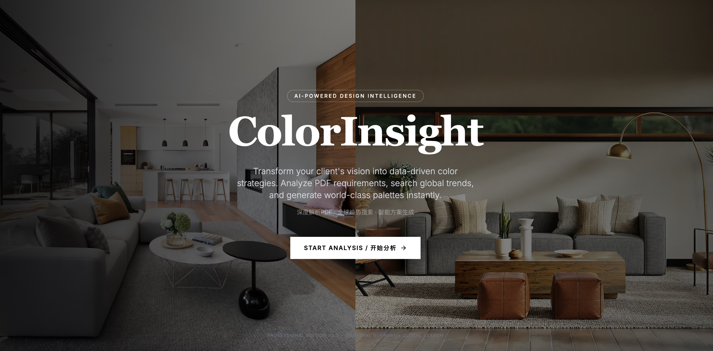
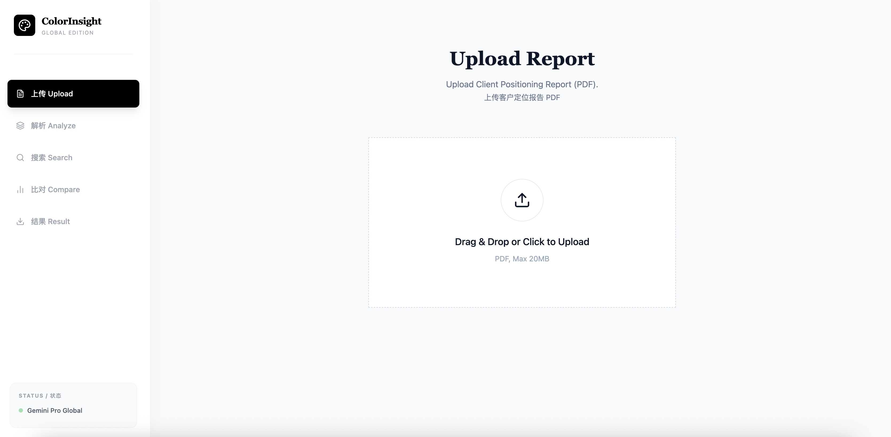

# ColorInsight AI / 色彩洞察 AI

[English](#english) | [中文](#中文)

---

## 📸 Screenshots / 预览

### Landing Page / 首页


### Color Scheme Comparison / 配色方案对比


---

<a name="english"></a>
## English

### 🎨 AI-Powered Color Strategy Intelligence Platform

**ColorInsight AI** transforms abstract client color requirements into actionable, data-driven color strategies. Upload a client positioning report, and let AI analyze, research, and generate professional color scheme recommendations.


---

### ✨ Key Features

| Feature | Description |
|---------|-------------|
| 📄 **PDF Analysis** | Extract color-related requirements from client positioning reports |
| 🔍 **Global Research** | Search global color trends, case studies via Google Knowledge Base |
| 🎯 **Smart Scoring** | Multi-dimensional scoring: Match, Trend, Market, Innovation, Harmony |
| 🖼️ **AI Visualization** | Generate photorealistic interior renders with recommended palettes |
| 📊 **Professional Reports** | Export detailed PDF reports with SWOT analysis |
| 🌐 **Bilingual Support** | Full English & Chinese interface |

---

### 🚀 How It Works

```
┌─────────────┐    ┌─────────────┐    ┌─────────────┐    ┌─────────────┐
│   Upload    │───▶│   Analyze   │───▶│   Search    │───▶│  Generate   │
│    PDF      │    │Requirements │    │  Global     │    │  Schemes    │
└─────────────┘    └─────────────┘    └─────────────┘    └─────────────┘
                                                                │
                                                                ▼
                                                        ┌─────────────┐
                                                        │   Export    │
                                                        │   Report    │
                                                        └─────────────┘
```

1. **Upload** - Upload client positioning report (PDF format)
2. **Analyze** - AI extracts color requirements, target audience, design preferences
3. **Search** - Query global color trends, competitor cases, market insights
4. **Generate** - Create 4 distinct color schemes with scientific scoring
5. **Export** - Download professional PDF report with recommendations

---

### 🛠️ Tech Stack

- **Frontend**: React 19 + TypeScript + Vite + Tailwind CSS
- **Backend**: Python Flask
- **AI Models**:
  - Text Analysis: Google Gemini 2.5 Flash
  - Image Generation: Gemini 3 Pro Image Preview
- **Charts**: Recharts (Radar, Bar charts)
- **PDF Export**: jsPDF + html2canvas

---

### 📋 Scoring Dimensions

| Dimension | Weight | Description |
|-----------|--------|-------------|
| Match | 30% | Alignment with client requirements |
| Trend | 25% | Current global color trends |
| Market | 20% | Market acceptance & competitiveness |
| Innovation | 15% | Creative & distinctive approach |
| Harmony | 10% | Color harmony & aesthetic balance |

---

### 🏗️ Project Structure

```
colorinsight-ai/
├── App.tsx                 # Main application component
├── components/
│   └── Layout.tsx          # App layout & navigation
├── services/
│   ├── geminiService.ts    # Backend API calls
│   └── pdfService.ts       # PDF text extraction
├── backend/
│   ├── app.py              # Flask backend server
│   ├── requirements.txt    # Python dependencies
│   └── .env                # Environment configuration
├── deploy/
│   ├── siliang-colorinsight.service  # Systemd config
│   └── nginx.conf          # Nginx routing
└── types.ts                # TypeScript type definitions
```

---

### 🔧 Quick Start

```bash
# Clone the repository
git clone https://github.com/SM01-studio/Colorinsight-AI-T-01.git
cd Colorinsight-AI-T-01

# Install frontend dependencies
npm install

# Install backend dependencies
cd backend && pip install -r requirements.txt

# Configure environment
cp backend/.env.example backend/.env
# Edit .env with your API keys

# Start backend (terminal 1)
cd backend && python3 app.py

# Start frontend (terminal 2)
npm run dev
```

Access the application at `http://localhost:3000`

---

### 🔑 Environment Variables

| Variable | Description | Required |
|----------|-------------|----------|
| `GEMINI_API_KEY` | Google Gemini API key for text analysis | Yes |
| `IMAGE_API_KEY` | API key for image generation | Yes |
| `JWT_SECRET` | JWT secret for authentication | Yes |
| `DEV_MODE` | Enable development mode bypass | Optional |

---

### 📄 License

This project is licensed under the MIT License.

---

<a name="中文"></a>
## 中文

### 🎨 AI 驱动的色彩策略智能平台

**色彩洞察 AI** 将客户对色彩的抽象需求转化为可执行的数据驱动色彩方案。上传客户定位报告，让 AI 自动分析、调研并生成专业的配色方案推荐。

---

### ✨ 核心功能

| 功能 | 说明 |
|------|------|
| 📄 **PDF 智能解析** | 从客户定位报告中精准提取色彩相关需求 |
| 🔍 **全球知识库搜索** | 通过 Google 搜索获取全球色彩趋势、案例研究 |
| 🎯 **科学评分体系** | 多维度评分：匹配度、流行度、市场接受度、创新性、协调性 |
| 🖼️ **AI 效果图生成** | 基于推荐配色生成逼真的室内效果图 |
| 📊 **专业报告导出** | 导出包含 SWOT 分析的详细 PDF 报告 |
| 🌐 **双语支持** | 完整的中英文界面 |

---

### 🚀 工作流程

```
┌─────────────┐    ┌─────────────┐    ┌─────────────┐    ┌─────────────┐
│   上传      │───▶│   解析      │───▶│   搜索      │───▶│   生成      │
│   PDF       │    │   需求      │    │   全球      │    │   方案      │
└─────────────┘    └─────────────┘    └─────────────┘    └─────────────┘
                                                                │
                                                                ▼
                                                        ┌─────────────┐
                                                        │   导出      │
                                                        │   报告      │
                                                        └─────────────┘
```

1. **上传报告** - 上传客户定位报告（PDF 格式）
2. **AI 解析** - AI 提取色彩需求、目标客群、设计偏好
3. **全球搜索** - 查询全球色彩趋势、竞品案例、市场洞察
4. **方案生成** - 创建 4 种独特配色方案并进行科学评分
5. **报告导出** - 下载包含推荐方案的专业 PDF 报告

---

### 🎯 项目目标

- **精准提取**：自动读取并解析 PDF 文件，提取所有与色彩相关的场景要求
- **智能搜索**：借助 Gemini 大模型搜索相关色彩案例、趋势报告及流行色信息
- **科学比对**：建立多维度指标评分体系，筛选出最佳色彩方案
- **专业输出**：生成结构清晰、内容详实的方案报告，支持 PDF 下载

---

### 📊 评分维度

| 维度 | 权重 | 说明 |
|------|------|------|
| 匹配度 (Match) | 30% | 与客户需求的契合程度 |
| 流行度 (Trend) | 25% | 符合当前全球色彩趋势 |
| 市场接受度 (Market) | 20% | 市场竞争力和接受程度 |
| 创新性 (Innovation) | 15% | 创意性和独特性 |
| 协调性 (Harmony) | 10% | 色彩搭配的和谐美感 |

---

### 🛠️ 技术栈

- **前端**：React 19 + TypeScript + Vite + Tailwind CSS
- **后端**：Python Flask
- **AI 模型**：
  - 文本分析：Google Gemini 2.5 Flash
  - 图像生成：Gemini 3 Pro Image Preview
- **图表**：Recharts（雷达图、柱状图）
- **PDF 导出**：jsPDF + html2canvas

---

### 🔧 快速开始

```bash
# 克隆仓库
git clone https://github.com/SM01-studio/Colorinsight-AI-T-01.git
cd Colorinsight-AI-T-01

# 安装前端依赖
npm install

# 安装后端依赖
cd backend && pip install -r requirements.txt

# 配置环境变量
cp backend/.env.example backend/.env
# 编辑 .env 填入你的 API Keys

# 启动后端（终端 1）
cd backend && python3 app.py

# 启动前端（终端 2）
npm run dev
```

访问地址：`http://localhost:3000`

---

### 🔑 环境变量

| 变量 | 说明 | 必需 |
|------|------|------|
| `GEMINI_API_KEY` | Google Gemini API 密钥（文本分析） | 是 |
| `IMAGE_API_KEY` | 图像生成 API 密钥 | 是 |
| `JWT_SECRET` | JWT 认证密钥 | 是 |
| `DEV_MODE` | 启用开发模式（跳过认证） | 可选 |

---

### 📁 项目结构

```
colorinsight-ai/
├── App.tsx                 # 主应用组件
├── components/
│   └── Layout.tsx          # 布局与导航
├── services/
│   ├── geminiService.ts    # 后端 API 调用
│   └── pdfService.ts       # PDF 文本提取
├── backend/
│   ├── app.py              # Flask 后端服务
│   ├── requirements.txt    # Python 依赖
│   └── .env                # 环境配置
├── deploy/
│   ├── siliang-colorinsight.service  # Systemd 配置
│   └── nginx.conf          # Nginx 路由
└── types.ts                # TypeScript 类型定义
```

---

### 📄 许可证

本项目采用 MIT 许可证。

---

### 🤝 Contributing / 贡献

Contributions are welcome! Please feel free to submit a Pull Request.

欢迎贡献代码！请随时提交 Pull Request。

---

### 📧 Contact / 联系方式

For questions or feedback, please open an issue on GitHub.

如有问题或反馈，请在 GitHub 上提交 Issue。

---

<p align="center">
  <b>ColorInsight AI</b> - Transforming Color Vision into Strategic Reality<br>
  <b>色彩洞察 AI</b> - 将色彩愿景转化为战略现实
</p>
